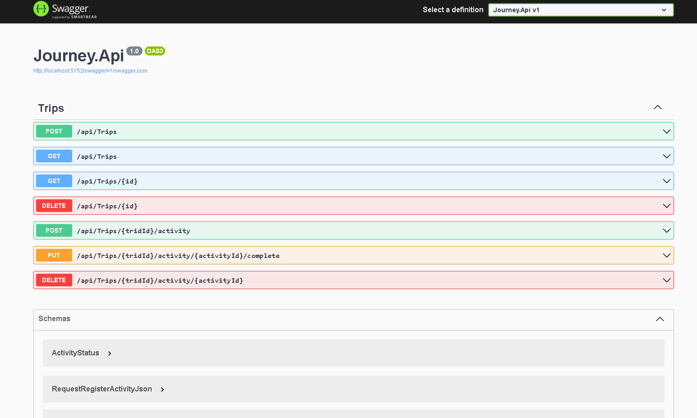

  

Aplicação desenvolvida no NLW Journey da Rocketseat na trilha C#.

  <a href="#-tecnologias">Tecnologias</a>&nbsp;&nbsp;&nbsp;|&nbsp;&nbsp;&nbsp;
  <a href="#-projeto">Projeto</a>&nbsp;&nbsp;&nbsp;|&nbsp;&nbsp;&nbsp;
  <a href="#memo-licença">Licença</a>

  

 

  

## 🚀 Tecnologias

Esse projeto foi desenvolvido com as seguintes tecnologias:

- C# Net Core 8.0
- Entity Framework Core
- SQLite
s
## Projeto

Nesse projeto iremos desenvolver uma versão simplificada de uma API de roteiro de viagem!

## Licença

Feito com 💜 by [Robson Mendonça](https://github.com/robsonamendonca) 🚀.

Este projeto esta sobre [MIT license](./LICENSE.txt).

Dê um ⭐️ se esse projeto te ajudou!